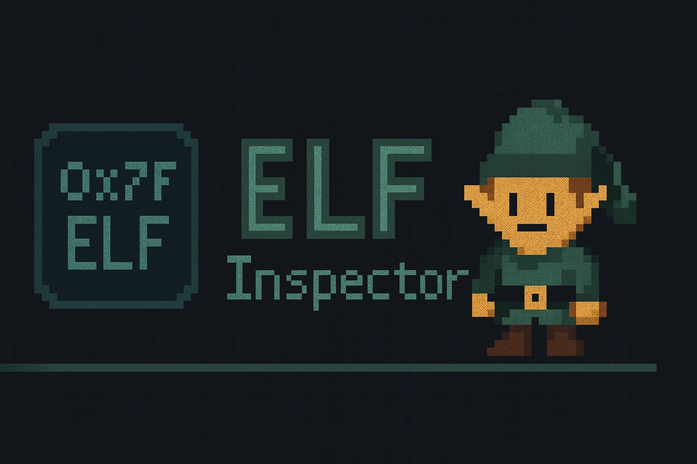

cat > README.md << 'EOF'
<h1 align="center">elfpeek</h1>

<p align="center">
  
</p>

<p align="center">
  
  
  
  
  
</p>

<p align="center">
  
  
  
</p>

<p align="center">
  Minimal ELF inspector with interactive REPL for quick binary analysis
</p>

---

<p align="center">
  
</p>

---

## Features

- **Interactive REPL** with readline support (history, line editing)
- **Dynamic colored prompt** - shows current file: `(elfpeek:ls)`
- **Colored hexdump** - null (gray), printable (green), control (red), high bytes (yellow)
- **Colored sections** - executable (green), writable (yellow), read-only (cyan)
- **ELF32/ELF64** support with little/big endian
- **Address resolver** - maps VA to segment, section, file offset, nearest symbol
- **Symbol tables** - both `.dynsym` and `.symtab`
- **No dependencies** - only glibc and `<elf.h>`

## Build
```bash
make
```

Optional: Install `libreadline-dev` for command history in REPL.

## Usage

### Interactive Mode
```bash
./elfpeek
```

### One-shot Mode
```bash
./elfpeek /bin/ls           # show headers, sections, symbols
./elfpeek /bin/ls 0x6760    # resolve address
```

## Commands

| Command | Alias | Description |
|---------|-------|-------------|
| `open <path>` | `o` | Open ELF file |
| `close` | | Close current file |
| `info` | `i` | Show ELF header |
| `sections` | `s` | List section headers |
| `phdr` | `p` | List program headers |
| `entry` | `e` | Show entry point |
| `symbols [dyn\|sym]` | `sym` | Dump symbol tables |
| `resolve <addr>` | `r` | Resolve virtual address |
| `dump <.sec\|@off> [n]` | `d` | Hex dump (section or offset) |
| `help` | `?` | Show help |
| `quit` | `q` | Exit |

## Color Coding

**Sections:**
- Green = executable (`.text`, `.plt`)
- Yellow = writable (`.data`, `.bss`)
- Cyan = read-only (`.rodata`)

**Hexdump:**
- Gray = null bytes (`00`)
- Green = printable ASCII (`20`-`7E`)
- Red = control characters (`01`-`1F`)
- Yellow = high bytes (`80`-`FF`)

## Why?

Not a replacement for `readelf` or `objdump`. Just a quick, focused tool for common RE questions:

- What's the binary layout?
- Which segment/section contains this address?
- What's the file offset for this VA?
- What bytes are at this location?
- Which function owns this address?

Also serves as readable ELF parsing example in C. Handles stripped and segment-only binaries gracefully.

## Test Binaries

`tests/` contains sample ELF files:

| File | Description |
|------|-------------|
| `elf32_le.bin` | 32-bit little-endian (i386) |
| `elf32_be.bin` | 32-bit big-endian (PowerPC) |
| `elf64_be.bin` | 64-bit big-endian (PowerPC64) |
| `elf64_le_pie.bin` | PIE executable |
| `elf64_le_static.bin` | Statically linked |
| `elf64_le_dynsym_only.bin` | Stripped, dynsym only |
| `elf64_le_so.bin` | Shared object |
| `elf64_le_segments_only.bin` | No section headers |

## License

MIT
EOF
